# Índice


# Introducción

Este proyecto se ha realizado con el fin de poner en práctica los diferentes servicios que ofrece Azure. Como lenguaje de programación se ha elegido Python y también se han utilizado otras tecnologías/aplicaciones como:
 - Databricks para la selección, transformación y guardado de los datos. 
 - Grafana para la visualización de datos.
 - Azure Data Studio (gestor de BDD) para el manejo de las tablas SQL y creación de procedimientos para ejecutarlos dentro de Data Factory.

 # Esquema general del proyecto


# Grupo de recursos

| Servicio | Descripción |
|----------|----------|
| Cuenta de Almacenamiento Data Lake v2    | Almacena la información en Azure   | 
| Databricks    | Cluster de databricks para realizar ETL   | 
| Data Factory   | Plataforma de orquestación de servicios y ETL  |
| SQL | Base de datos para mantener la información en formato SQL |
| Logic App | Aplicación para gestión y monitorización de errores en Data Factory |
| Log Analytics | Servicio que guarda la información sobre errores, métricas y logs en Data Factory |
| Notebooks o Libros de Azure | Guardan las consultas de KQL que obtienen información de Log Analytics
| Alertas personalizadas | Alertas sobre métricas, control de presupuesto y errores en Data Factory |


# Almacenamiento

#### ¿Qué es Data Lake Gen2?

Se trata de un servicio de almacenamiento optimizado donde se pueden cargar grandes volúmenes de datos para el análisis a gran escala. 

Se caracteriza por no depender de un esquema de datos, por lo que da mucha flexibilidad para migrar cualquier tipo servicio/aplicación, y permite gestionar la información en contenedores blob (objeto binario grande), tablas y colas.

#### Estructura

El proyecto contiene 2 contenedores y dentro sus respectivos directorios para almacenar y tener ordenada la información.

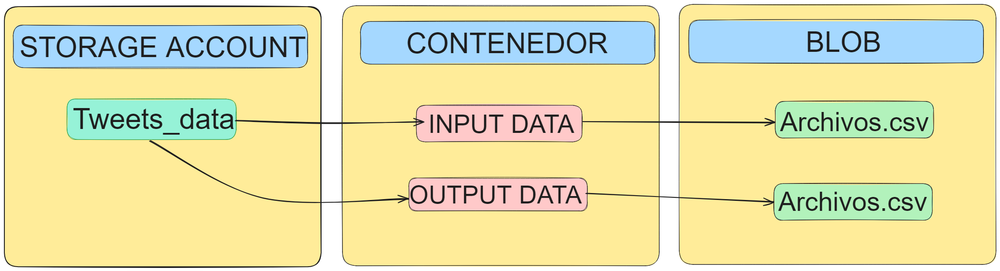

# Azure Data Factory

Data Factory es la raíz de infraestructura. Se compone de una única ```pipeline``` parametrizada que realiza todo el proceso. También integra una gestión de errores y alertas dedicadas.

## Esquema de Data Factory

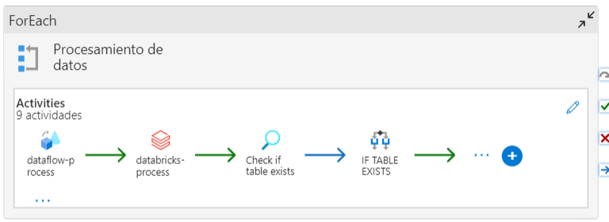
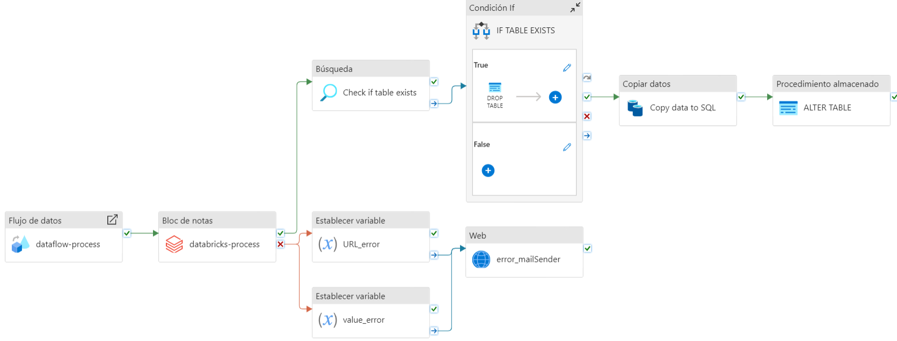

#### ¿Qué es Data Factory?

 Azure Data Factory permite conectar los diferentes servicios de Azure entre sí para realizar la extracción, transformación y carga (ETL).

#### Estructura del Data Factory

Consiste en un ``forEach`` que recibe por parámetros los archivos a procesar que pueden ser 1, 2, 3 o N. Después cada elemento del for (archivo.csv), va avanzando por cada actividad interna hasta completarse.

Se ha elegido usar parámetros en lugar de variables para, que en caso de tener 30 archivos, puedas elegir procesar uno o varios de ellos. Esto también simplifica la estructura del Data Factory y otorga flexibilidad.

A continuación se explicarán las actividades internas por separado.

#### Parámetros

Los parámetros en Azure funcionan por niveles o capas. Puedes definir parámetros a distintos niveles:
- A nivel de Pipeline
- A nivel de DataFlow
- A nivel de DataSet
- etc..

Dentro del proyecto, los parámetros a nivel de Pipeline se propagan a las capas inferiores haciendo que por ejemplo, el DataFlow reciba el elemento del for y procese un archivo diferente en cada iteración o que el archivo resultante se guarde con el nombre de la empresa en lugar de 'part-001-fragmentid-14445'.

En este caso, existe un único parámetro con los nombres del archivo.csv que se propaga al resto de actividades y los emails a los que se van a enviar los detalles en caso de que se produzca un error.

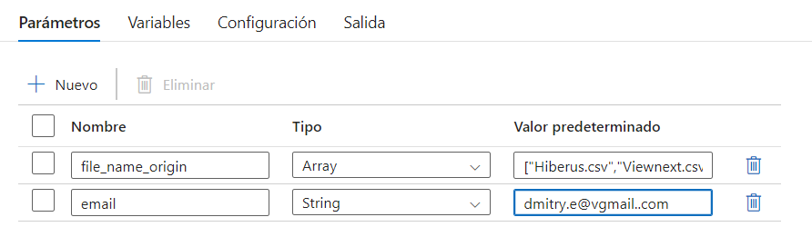

## Azure DataFlow

Es la primera actividad que va a ejecutar el ForEach. Su función es procesar los diferentes archivos.csv y unirlos en un único resultado. Además, se agrega una columna adicional que se usará como Primary Key en cada tabla de la BDD.

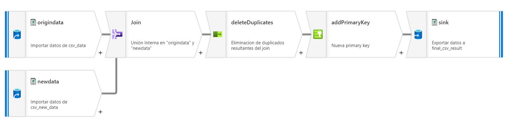

#### Configuración de parámetros del DataFlow


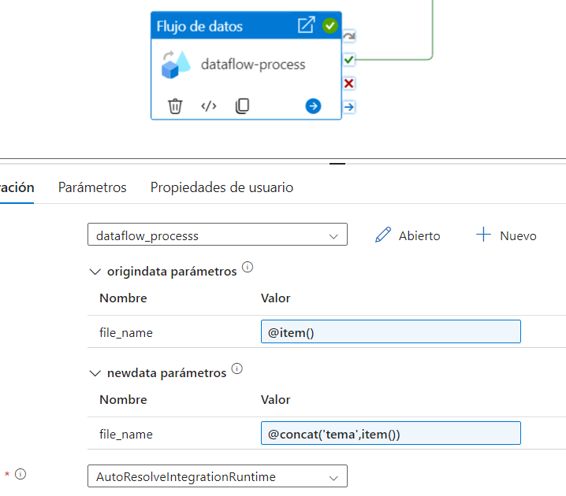

**El Dataset origindata** carga el archivo.csv del DataFlow que es el elemento en curso del forEach como: "Hiberus.csv".

**El dataset de newdata**, concatena "tema" al nombre del fichero para identificar correctamente el archivo adicional. Esta aproximación también permite evitar crear más parámetros a nivel de pipeline con nombres csv explícitos.

El resultado se carga en los datasets y se unen mediante las actividades internas del dataflow (join, union etc...) en un único archivo que se guarda en un contenedor del Data Lake.

## Databricks

#### ¿Qué es Databricks?

Es una plataforma analítica basada en Apache Spark que ofrece una solución ETL completa y permite tratar los datos en forma de batch (por lotes), streaming o via machine learning. 

En este caso, se ha utilizado un notebook de Databricks para realizar el **análisis de sentimientos** de cada tweet a través de un modelo LLM.

#### Estructura

Se utilizó un ``Token SAS`` para conectarse al servicio de Azure Databricks. Después, dentro de la pipeline Databricks procesa los archivos resultantes del Data Flow.

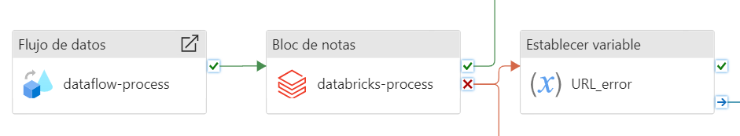

El nombre de cada archivo se obtiene de forma dinámica, mediante parámetros que se indican tanto en Azure como en el Notebook.

Después se realiza un Script en Python para:
- Realizar un análisis de los tweets con un modelo LLM de HuggingFace.
- Seleccionar, tratar y organizar la información.
- Guardar la información en un directorio temporal para renombrarla y moverla al contenedor de Azure correspondiente.

#### Script

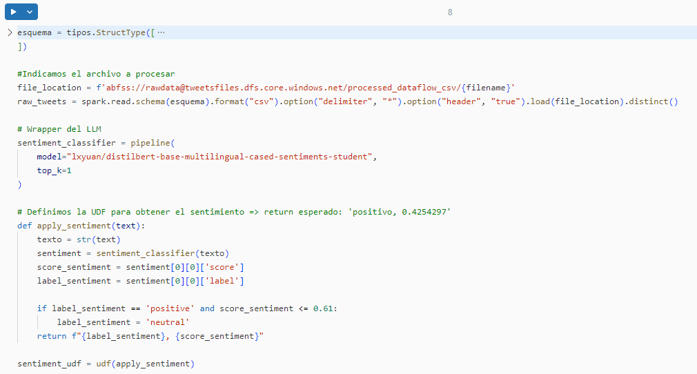

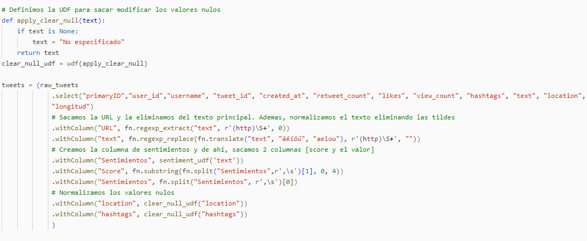

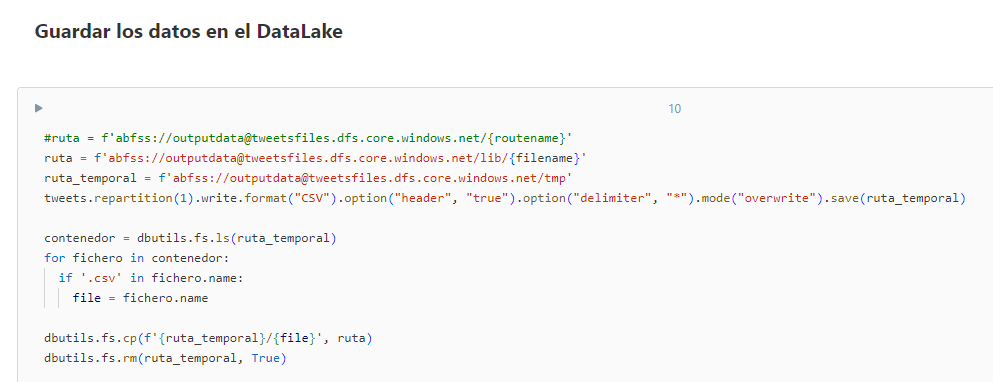


## Creación de la BDD de forma automática

#### Esquema general del proceso

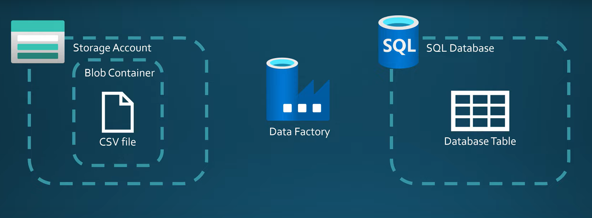

Azure Data Factory permite copiar datos con la actividad de ```COPY DATA```. En este caso, recuperaremos el archivo.csv resultante del Databricks de nuestro contenedor de Data Lake para copiar y guardar los datos en una BDD SQL. 

Asimismo, esta actividad es capaz de generar una, o múltiples tablas de forma automática con una estructura personalizada. Es decir, mediante ``COPY DATA`` puedes automatizar todo el proceso de creación del esquema e inserción de datos en la BDD.

Para ello, necesitas configurar el flujo de Data Factory, en mi caso he incluido:
- Una actividad de ``COPY DATA`` para que haga la tabla con sus tipos de datos.
- Una actividad de ``PROCEDIMIENTO`` para borrar los datos en caso de existir.
- Una actividad de ``PROCEDIMIENTO`` para modificar la tabla y definir una ``PRIMARY KEY``.
- Parametrizar las actividades para que por cada elemento del for se cree una nueva tabla con el nombre correspondiente.

#### Explicación del DataFlow

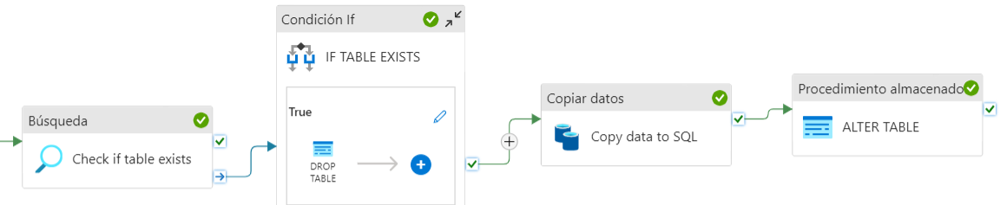

Podemos ligar la actividad de ``BÚSQUEDA`` con la BDD para realizar una consulta automática. Si esta consulta nos devuelve un resultado, significa que existen datos en la tabla y se procederá a ejecutar el ``PROCEDIMIENTO DE DROP TABLE``. 

Después enlazamos el flujo con la actividad de ``COPY DATA`` para generar la tabla con el nombre de la empresa en curso y sus respectivos datos. Por último, desencadenamos los ``PROCEDIMIENTOS`` creados en la BDD para personalizar la tabla resultante.

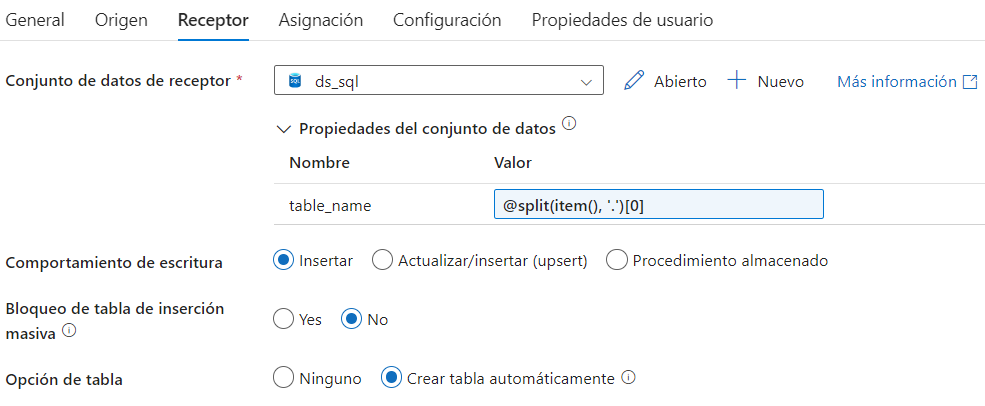

#### Resultado


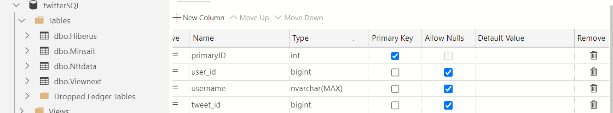

El parámetro que usan los procedimientos de la base de datos es **el elemento** del forEach en curso.

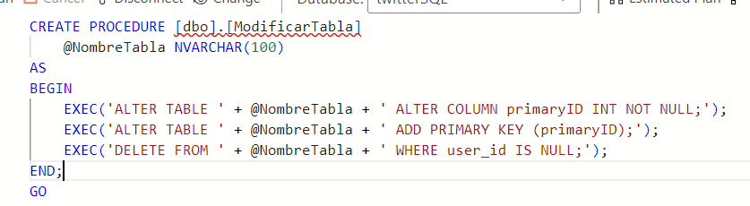
---
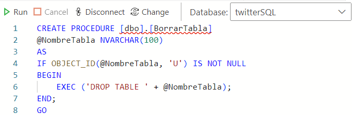

El ``'U'`` en la función ``OBJECT_ID`` es un parámetro que especifica el tipo de objeto que se está buscando en la base de datos. 

- ``'U':`` Se refiere a una tabla de usuario.
- ``'V':`` Se refiere a una vista.
- ``'P':`` Se refiere a un procedimiento almacenado.
- ``'FN':`` Se refiere a una función definida por el usuario (escalar).
- ``'IF':`` Se refiere a una función definida por el usuario (tabla en línea).

Si se encuentra una tabla con ese nombre, la función devuelve su identificador único de objeto (object_id); de lo contrario, devuelve ``NULL``.

## Gestión de errores, alertas y métricas

Azure tiene múltiples formas para gestionar los logs, métricas y errores. En esencia, es posible configurar una Alerta para cada servicio o grupo de recursos en particular. 

Para este proyecto **se ha configurado Data Factory** para volcar todas las métricas y logs en **Azure Log Analytics** y después se han creado ``alertas personalizadas`` mediante el lenguaje kusto (KQL).

#### Alerta de presupuesto

Podemos definir alertas para que una vez superado un cierto umbral se nos avise via mail o SMS.

1. Creamos un presupuesto en el apartado de Cost Management / presupuesto.
2. Configuramos la alerta en la misma interfaz basándonos en el presupuesto especificado.

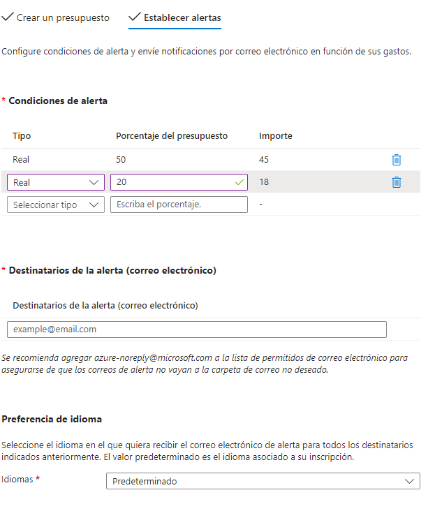

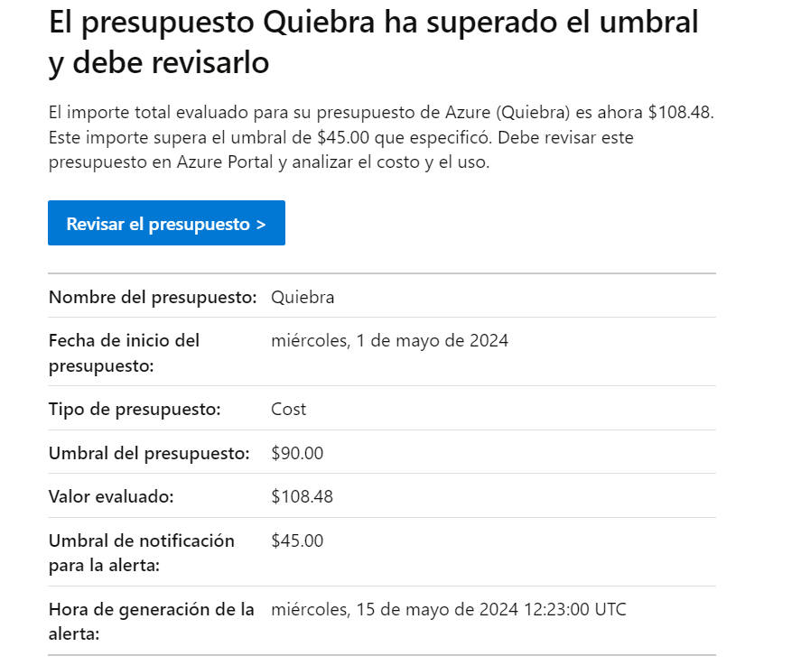


### Azure Log Analytics

Este servicio nos permite unificar todas las métricas/logs de nuestros servicios y se usa para editar y ejecutar consultas de registro. Además, lo interesante de este sistema centralizado es que puedes hacer “notebooks” aka Libros de cualquier consulta y se pueden guardar. 

De forma que, una vez hecha una consulta no hay necesidad de volverla a escribir. Esto permite crear filtros de logs, alertas, métricas totalmente a tu gusto y mantener todas las consultas documentadas en un solo lugar.

#### Alertas personalizadas con KQL

1. Creamos el servicio de Log Analytics.
2. Activamos el volcado de datos en el servicio de Data Factory y seleccionamos los datos que queramos obtener.

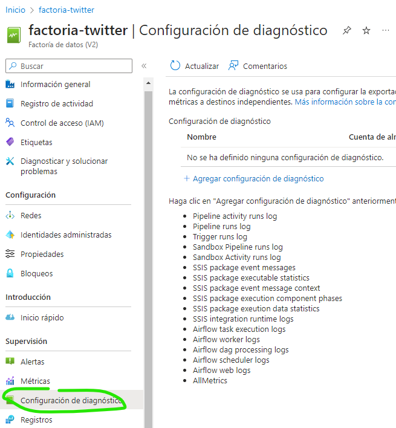

**Log Analytics** generará diferentes tablas con la información seleccionada con las
cuales podemos interactuar tal como si de SQL se tratase:

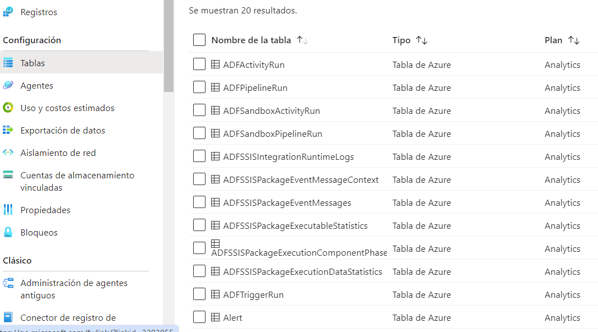

3. Realizamos consultas personalizadas en KQL para integrarlas posteriormente con las Alertas

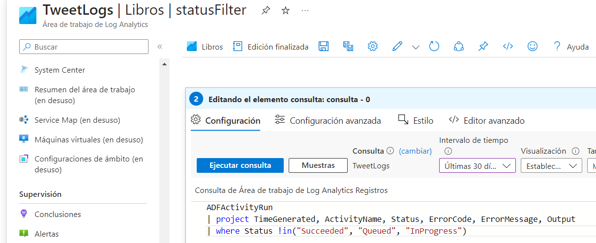

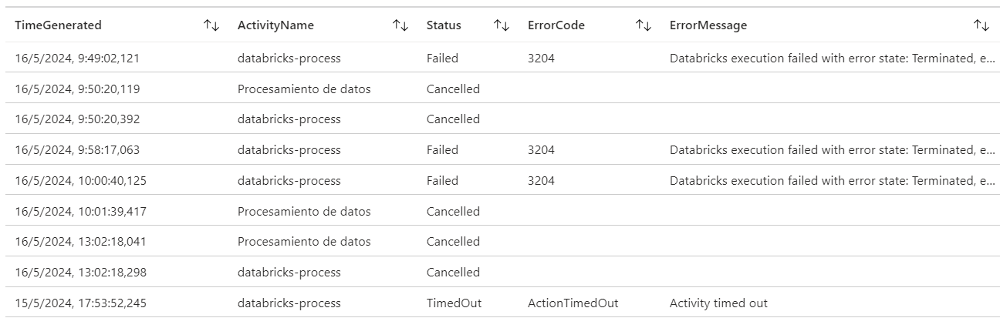

4. Finalmente, configuramos la alerta para que nos envíe un mail en caso de cumplir las condiciones establecidas

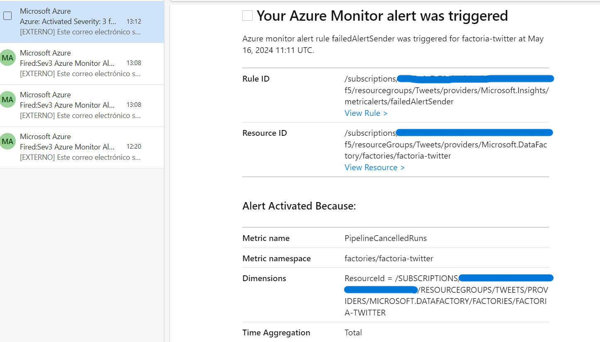


### Logic Apps orientadas a notificaciones

Es posible configurar y crear pequeñas aplicaciones que notifiquen al destinatario y personalizar esta información para tus necesidades y caso particular.

Por ejemplo, si se tiene constancia de que un servicio es propenso al fallo, podríamos configurar una alerta al correo electrónico para que nos muestre que ha sucedido.

#### Alerta de error personalizada con Logic APP

A continuación, se muestra un ejemplo para el servicio de Databricks en un DataFactory.

1. Configuramos el pipeline para que, en caso de error se pueda aislar, parsear y transmitir por HTTP a la logic app.

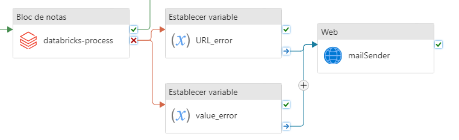

2. La logic app recibe el JSON de la actividad y procede a realizar la acción
pre-configurada. El esquema JSON es totalmente personalizable

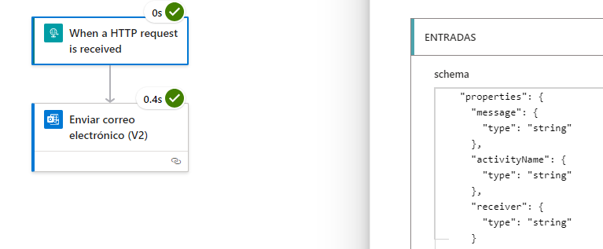

3. El destinatario recibe el email donde se especifica:
    - El nombre de la pipeline, factoría y archivo que dio el error.
    - El error en “bruto” de Databricks.
    - La URL del debugger de Databricks.

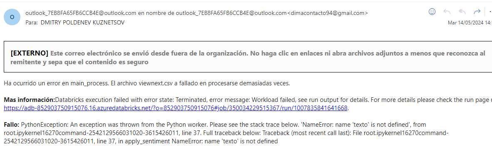

**La URL de Databricks requiere autentificación, pero te permite acceder a un análisis del problema muy completo que incluye diferentes métricas:**

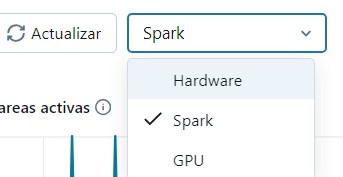

##### Métricas del hardware

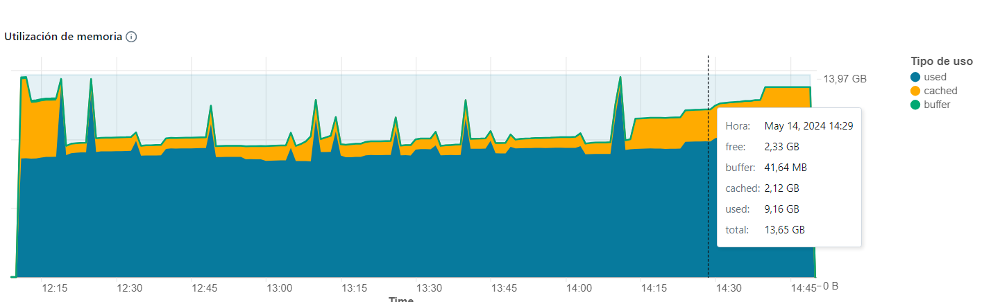

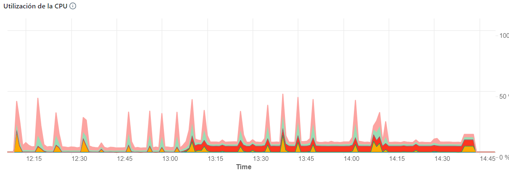

##### Métricas de Spark

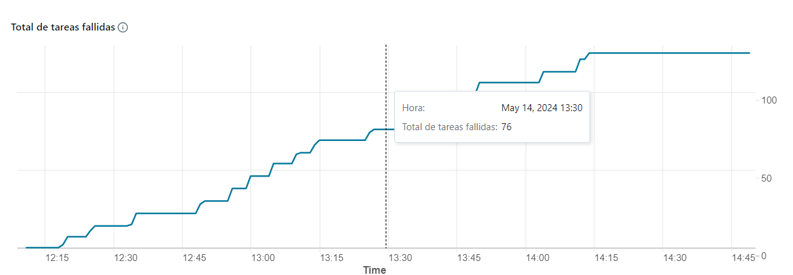

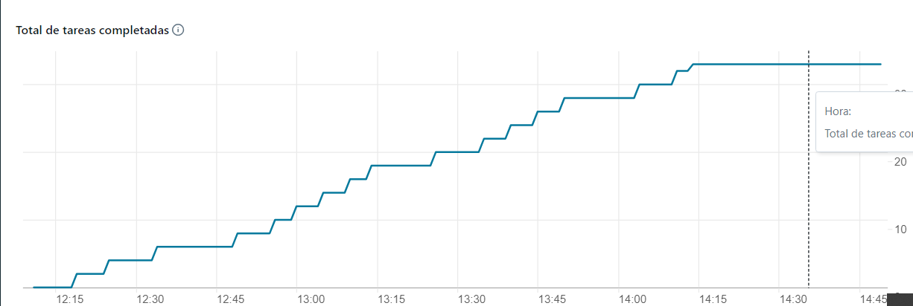

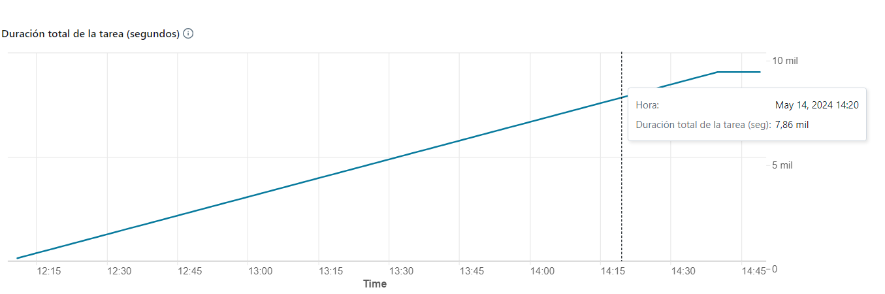

# Visualización - Grafana

*En la carpeta ``PDF`` es posible ver todos los gráficos.*

#### ¿Qué es Grafana?

Grafana es una plataforma interactiva y dinámica de código abierto. Permite almacenar, visualizar, analizar y comprender métricas de rendimiento/datos de una forma clara y sencilla. 

#### Visualizaciones totales y temas más populares

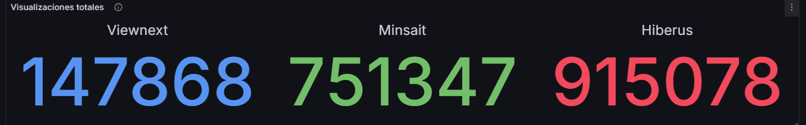

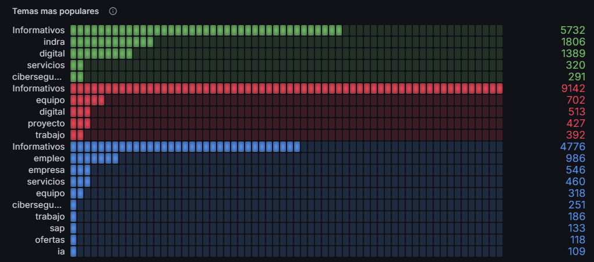

#### Distribución de sentimientos negativos

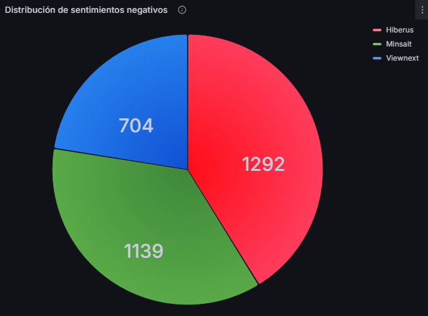

#### Distribución por geolocalización entre Minsait y Viewnext

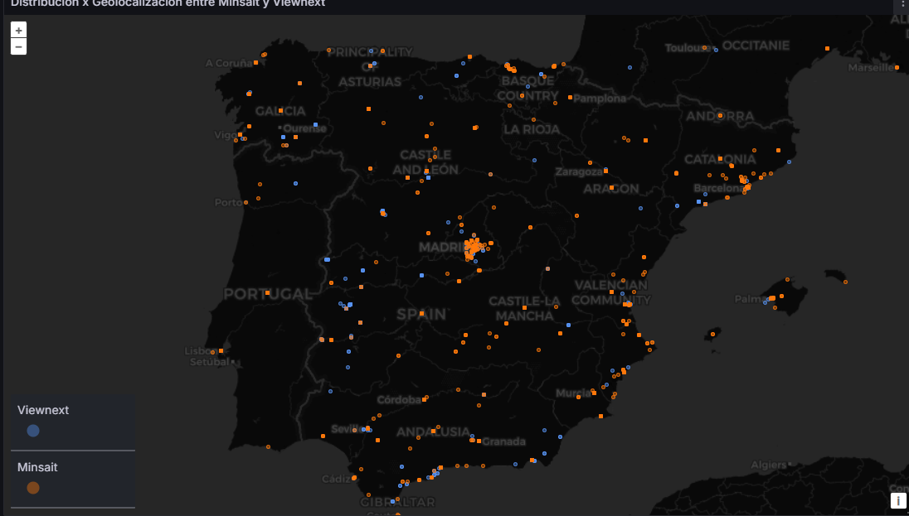

#### Interacciones totales (likes, retweets y visualizaciones) de Viewnext en el último año 

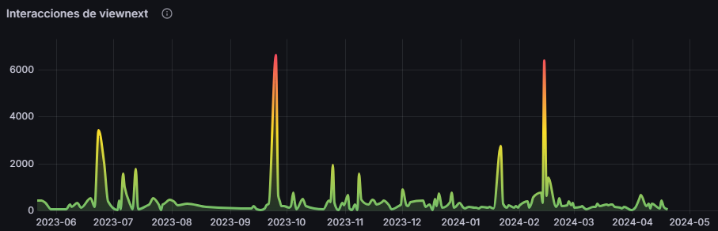

#### Horas de actividad donde más aparece NTTDATA

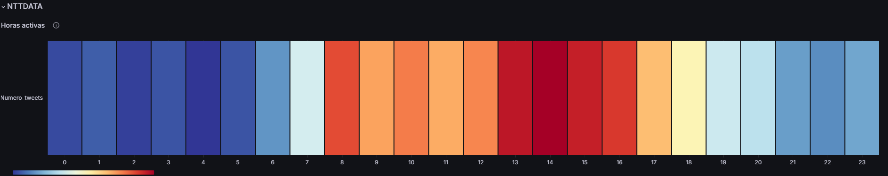

En este mapa de calor, entre las 13:00 y las 15:00 horas sería el rango donde han twiteado sobre la empresa.

#### Visualización de sentimientos de Minsait por año

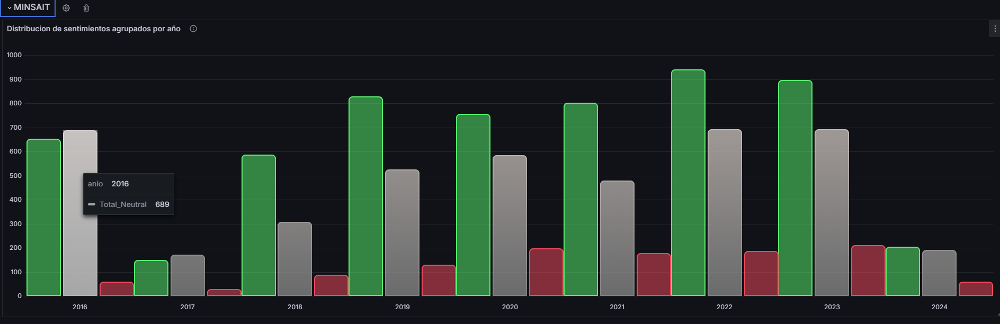

* Color verde: Tweets con tendencia positiva.
* Color gris: Tweets neutrales (informativos).
* Color rojo: Tweets con tono negativo.

#### Frecuencia de Tweets por mes de Hiberus

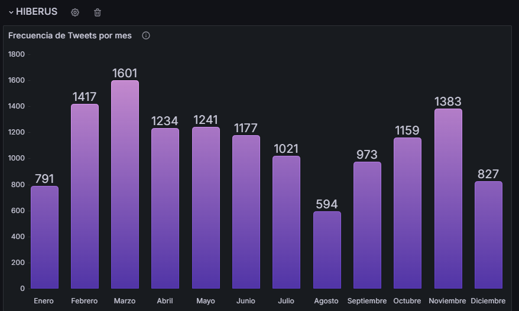

#### Actividad de TOP 5 usuarios de Hiberus

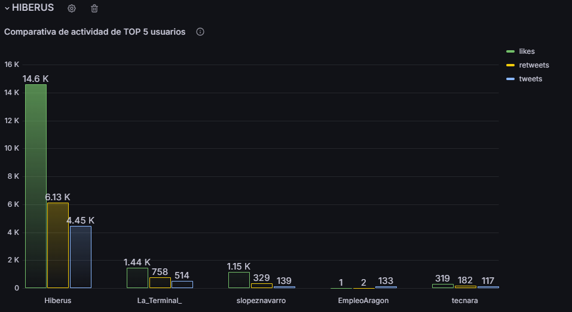